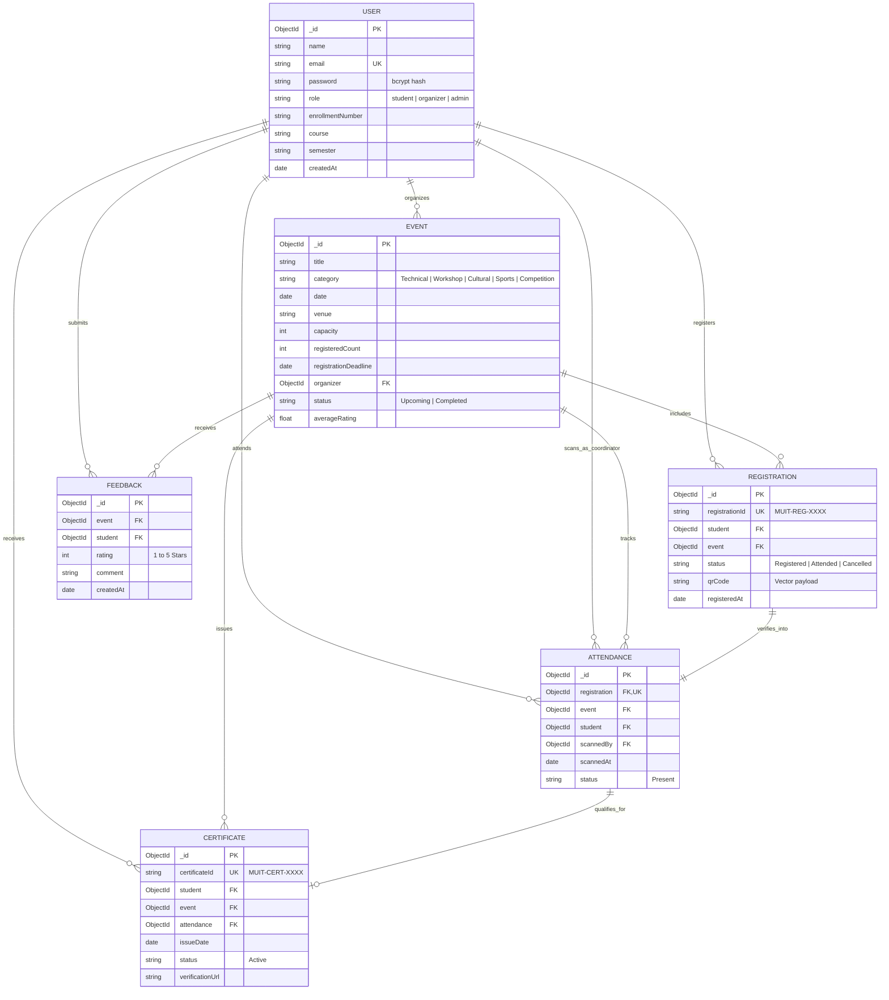

# MUIT Event Management System — Database Architecture & ERD Specification

> **Subsystem**: Data Persistence Layer (MongoDB / Mongoose ODM)  
> **Directory**: `database/`  
> **Institution**: Maharishi University of Information Technology (MUIT)  
> **Database**: `muit_event_db` (Port `27017` / MongoDB Atlas Cluster)  

---

## 1. Database Architecture & Overview
The database layer uses MongoDB 7.0 with Mongoose ODM. It consists of 6 normalized, high-performance collections with strict unique and compound indexing to guarantee business data integrity.

---

## 2. Entity-Relationship (ER) Diagram

---

## 3. Data Dictionary & Collection Specifications

### 3.1 `users` Collection
Stores student, faculty organizer, and administrator accounts.
- `_id`: ObjectId (Primary Key)
- `email`: String (Unique Index, lowercase)
- `password`: String (Salted bcrypt hash, select: false)
- `role`: Enum: `'student'`, `'organizer'`, `'admin'`
- `enrollmentNumber`: String (Indexed)
- `course`: String (Default: `'BCA'`)
- `semester`: String (Default: `'4th Semester'`)

### 3.2 `events` Collection
Stores all campus symposiums, workshops, and fests.
- `_id`: ObjectId (Primary Key)
- `title`: String (Required)
- `category`: Enum (`Technical`, `Workshop`, `Cultural`, `Sports`, `Competition`, `Career & Placement`)
- `date`: Date (Scheduled event date)
- `venue`: String (Campus hall, auditorium, or lab)
- `capacity`: Number (Max participants)
- `registeredCount`: Number (Current registrations)
- `organizer`: ObjectId (References `users._id`)
- `status`: Enum (`Upcoming`, `Ongoing`, `Completed`, `Cancelled`)

### 3.3 `registrations` Collection
Stores student registrations and dynamic QR pass data.
- `_id`: ObjectId (Primary Key)
- `registrationId`: String (Unique Index, e.g., `MUIT-REG-2026-TF001`)
- `student`: ObjectId (References `users._id`)
- `event`: ObjectId (References `events._id`)
- **Compound Unique Index**: `{ student: 1, event: 1 }` (Strictly blocks double registration)
- `status`: Enum (`Registered`, `Attended`, `Cancelled`)
- `qrCode`: String (Vector QR code payload)

### 3.4 `attendances` Collection
Records verified gate check-ins.
- `_id`: ObjectId (Primary Key)
- `registration`: ObjectId (Unique Index, References `registrations._id`). Enforces single check-in rule.
- `event`: ObjectId (References `events._id`)
- `student`: ObjectId (References `users._id`)
- `scannedBy`: ObjectId (References `users._id` - gate coordinator)
- `scannedAt`: Date (Exact timestamp)
- `status`: Enum (`Present`)

### 3.5 `certificates` Collection
Houses verifiable academic credentials.
- `_id`: ObjectId (Primary Key)
- `certificateId`: String (Unique Index, e.g., `MUIT-CERT-2026-PL981`)
- `student`: ObjectId (References `users._id`)
- `event`: ObjectId (References `events._id`)
- `attendance`: ObjectId (References `attendances._id`)
- `verificationUrl`: String (`/verify/:certificateId`)
- `issueDate`: Date

### 3.6 `feedbacks` Collection
Stores student 1-5 star event ratings.
- `_id`: ObjectId (Primary Key)
- `event`: ObjectId (References `events._id`)
- `student`: ObjectId (References `users._id`)
- `rating`: Number (1 to 5)
- `comment`: String
